🌟✨ **Elevate Your Business with Our Cutting-Edge Solutions** ✨🌟

Presenting a 🔐 **Trustworthy** and 🚀 **Innovative** proposal for your business needs! Leverage the power of our top-notch features:

🎯 **TikTok X-Gorgon, X-Argus, and TTEncrypt algorithms (unidbg)** Experience unparalleled security and performance with these advanced algorithms, perfect for your business! 💪

🤖 **Device Registration** Fully automate new devices registration process with our advanced device registration solution! 📱

⚙️ **Autoreg** Automate your accounts registration process with ease, saving time and resources! ⏰

🐍 **Python API Library (adaptable to various application versions)** Stay ahead of the curve with our flexible and adaptable API library for all your application needs! 🌐

💼 What We Offer:

- 🌐 API/Source Code

- 🎥 Demonstration Accessible

- 📧 Inquiries via email: polk9pjuar@gmail.com

- 🕐 **Prompt Response Guaranteed Within 24 Hours!**

Don't miss this opportunity to enhance your business with our cutting-edge solutions! 🌟 Contact us now! 📩

---

---

---


Tiktok Algorithm | 抖音算法

# [Contact Telegram](https://t.me/xgxkxaxl)
# [Contact SnapChat](https://www.snapchat.com/add/xgxkxaxl)
# [联系需翻墙](https://t.me/xgxkxaxl)
# [联系需翻墙](https://www.snapchat.com/add/xgxkxaxl)


# X-Ladon, X-Argus, X-Gorgon, X-Khronos, X-Helios, X-Medusa, Device Registration, 抖音播放量, 抖音分享
Tiktok X-Argus X-Ladon X-Gorgon X-Khronos Algorithm, Device Registration Algorithm  
抖音四神,抖音加密算法,抖音播放量,抖音分享,抖音播放查询接口

## Tiktok Algorithm

### Device Register
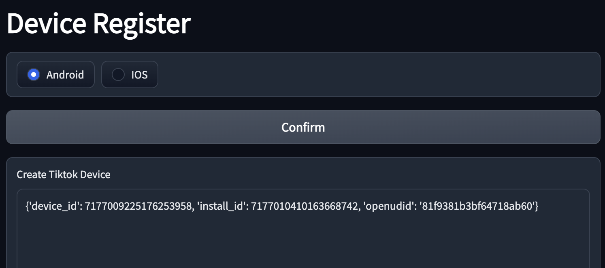

```json
{
  "device_id": "7177009225176253958",
  "iid": "7177010410163668742",
  "openudid": "81f9381b3bf64718ab60"
}
```


### X-Gorgon X-Khronos algorithm


```json
{
  "X-Gorgon": "0404d0e40001df9b48851704a5760372721ccf34c4329999af84",
  "X-Khronos": "1671028069"
}
```

### X-Argus X-Ladon algorithm
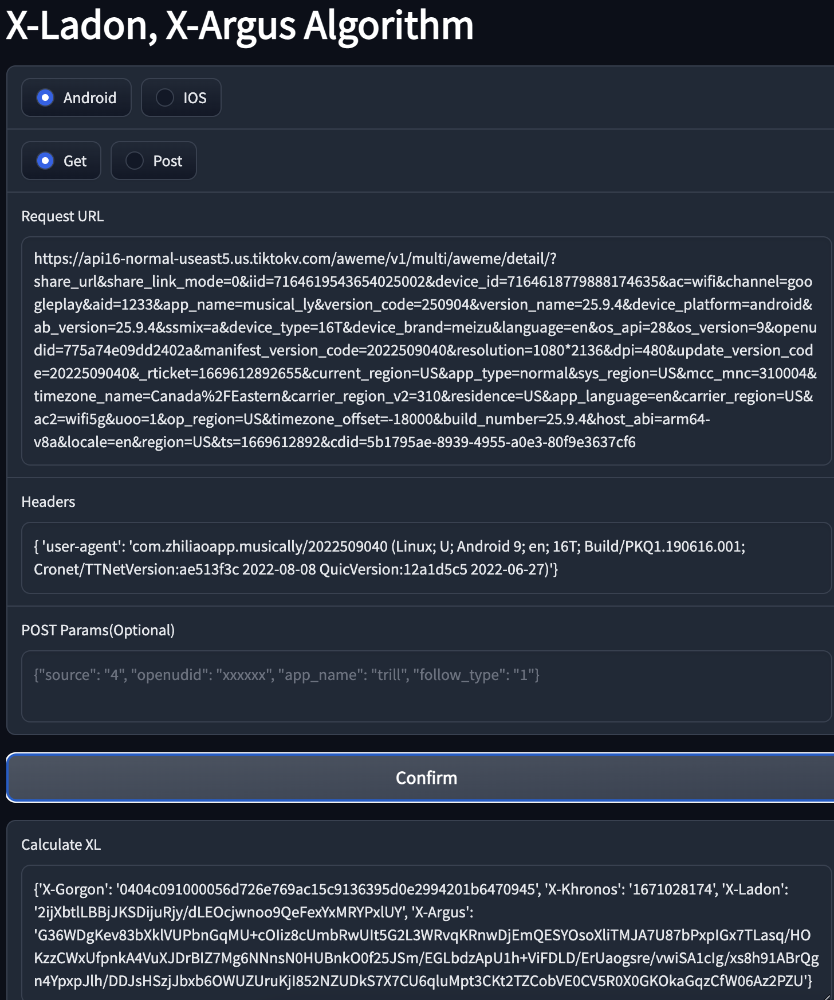

```json
{
  "X-Gorgon": "0404c091000056d726e769ac15c9136395d0e2994201b6470945",
  "X-Khronos": "1671028174",
  "X-Ladon": "2ijXbtlLBBjJKSDijuRjy/dLEOcjwnoo9QeFexYxMRYPxlUY",
  "X-Argus": "G36WDgKev83bXklVUPbnGqMU+cOIiz8cUmbRwUIt5G2L3WRvqKRnwDjEmQESYOsoXliTMJA7U87bPxpIGx7TLasq/HOKzzCWxUfpnkA4VuXJDrBIZ7Mg6NNnsN0HUBnkO0f25JSm/EGLbdzApU1h+ViFDLD/ErUaogsre/vwiSA1cIg/xs8h91ABrQgn4YpxpJlh/DDJsHSzjJbxb6OWUZUruKjI852NZUDkS7X7CU6qluMpt3CKt2TZCobVE0CV5R0X0GKOkaGqzCfW06Az2PZU"
}
```

### Tiktok views


### Tiktok live data
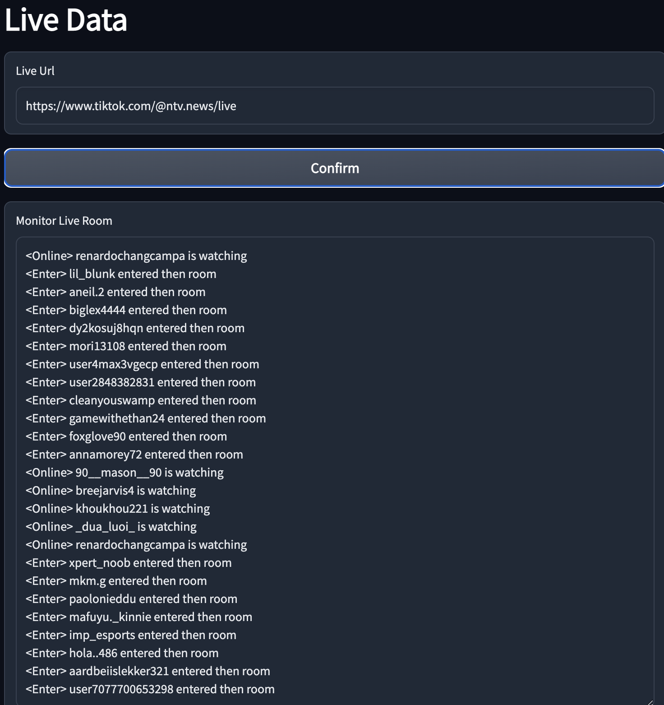

```
<Online> renardochangcampa is watching
<Enter> lil_blunk entered then room
<Enter> aneil.2 entered then room
<Enter> biglex4444 entered then room
<Enter> dy2kosuj8hqn entered then room
<Enter> mori13108 entered then room
<Enter> user4max3vgecp entered then room
<Enter> user2848382831 entered then room
<Enter> cleanyouswamp entered then room
<Enter> gamewithethan24 entered then room
<Enter> foxglove90 entered then room
<Enter> annamorey72 entered then room
<Online> 90__mason__90 is watching
<Online> breejarvis4 is watching
<Online> khoukhou221 is watching
<Online> _dua_luoi_ is watching
<Online> renardochangcampa is watching
<Enter> xpert_noob entered then room
<Enter> mkm.g entered then room
<Enter> paolonieddu entered then room
<Enter> mafuyu._kinnie entered then room
<Enter> imp_esports entered then room
<Enter> hola..486 entered then room
<Enter> aardbeiislekker321 entered then room
<Enter> user7077700653298 entered then room
```

## 抖音算法，抖音协议

### 设备算法
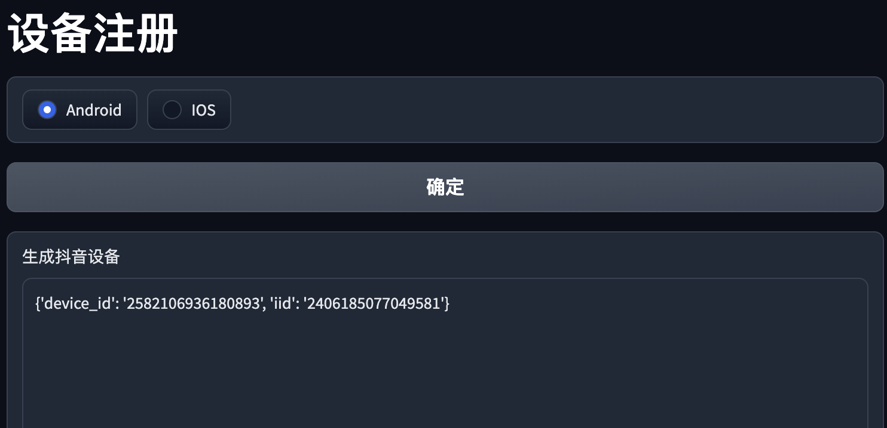

```json
{
  "device_id": "2582106936180893",
  "iid": "2406185077049581",
}
```


### X-Gorgon X-Khronos 算法
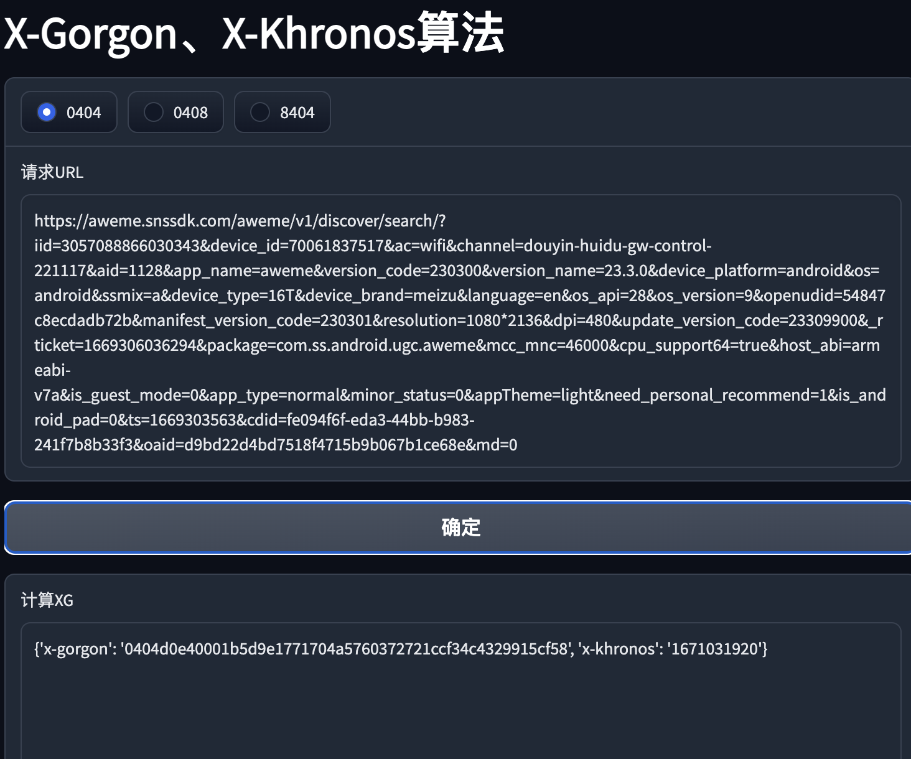

```json
{
  "X-Gorgon": "0404d0e40001b5d9e1771704a5760372721ccf34c4329915cf58",
  "X-Khronos": "1671031920"
}
```

### X-Argus X-Ladon 算法，四神算法
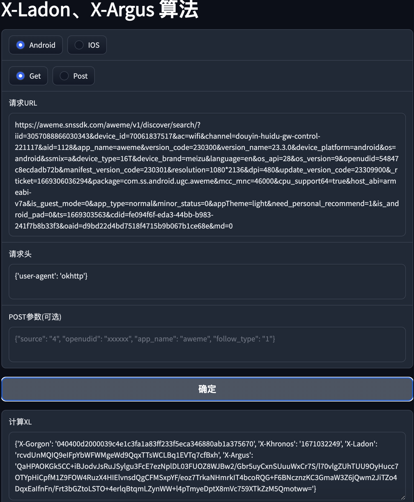

```json
{
  "X-Gorgon": "040400d2000039c4e1c3fa1a83ff233f5eca346880ab1a375670",
  "X-Khronos": "1671032249",
  "X-Ladon": "rcvdUnMQIQ9eIFpYbWFWMgeWd9QqxTTsWCLBq1EVTq7cfBxh",
  "X-Argus": "QaHPAOKGk5CC+iBJodvJsRuJSylgu3FcE7ezNplDL03FUOZ8WJBw2/Gbr5uyCxnSUuuWxCr7S/l70vlgZUhTUU9OyHucc7OTYpHiCpfM1Z9FOW4RuzX4HIElvnsdQgCFMSxpYF/eoz7TrkaNHmrkIT4bcoRQG+F6BNcznzKC3GmaW3Z6jQwm2JiTZo4DqxEaIfnFn/Frt3bGZtoLSTO+4erlqBtqmLZynWW+l4pTmyeDptX8mVc759XTkZzM5Qmotww="
}
```

### X-Argus X-Ladon X-Medusa X-Helios 算法，六神算法
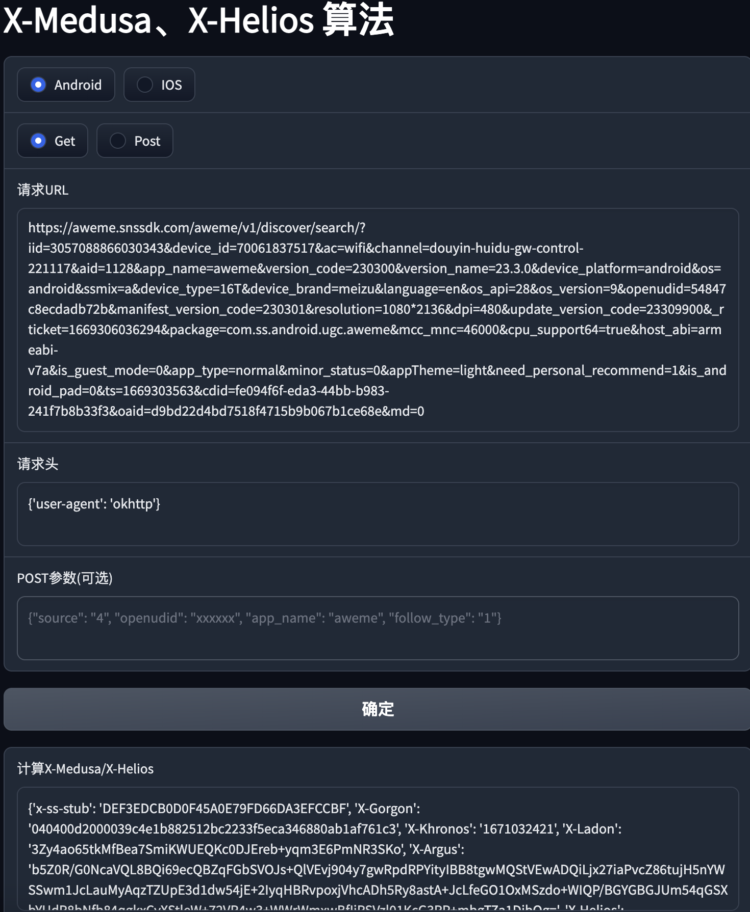

```json
{
  "x-ss-stub": "DEF3EDCB0D0F45A0E79FD66DA3EFCCBF",
  "X-Gorgon": "040400d2000039c4e1b882512bc2233f5eca346880ab1af761c3",
  "X-Khronos": "1671032421",
  "X-Ladon": "3Zy4ao65tkMfBea7SmiKWUEQKc0DJEreb+yqm3E6PmNR3SKo",
  "X-Argus": "b5Z0R/G0NcaVQL8BQi69ecQBZqFGbSVOJs+QlVEvj904y7gwRpdRPYityIBB8tgwMQStVEwADQiLjx27iaPvcZ86tujH5nYWSSwm1JcLauMyAqzTZUpE3d1dw54jE+2IyqHBRvpoxjVhcADh5Ry8astA+JcLfeGO1OxMSzdo+WIQP/BGYGBGJUm54qGSXbYUdR8bNfb84qgkxCyXStleW+72VR4w3+WWrWmxwBfIjRSVzl01KcG3RP+mbgTZa1DibQg\u003d",
  "X-Helios": "el7YyIk6yRtsQmkvpYLOYGTxfM42a3HIGolEZZ2eafA5ZuGG",
  "X-Medusa": "fPR/1A0VITNVZN0zcdo1FCLfz1zghbOJCd+t0EkIs4CyKWDnBj+rswUK5iZzJMcqeb5Sap68/Bz6nsKTyI3bo1Q3f/SeofO2sqkpBP0r2lIBSz69655Jk2YGEIPpWyVZiRuOJiu1MfpRiRjDBIuLnJyOuI/XzAgd3U4XZfTpoZ7DewEba+/VSgeCM4RJ9TtWJeGe9f7ibwynRKAuvF6DrJ0PekU9PppkgcG0qhTH8YVV3ryKTMKp9OLOK0s25LG5STy27gWsV5R7/HeEacIwlInAZcb7U2Smypow+giYXFUFK7+s7Ten0RtkIPlFFenWYBFIQQTZLaOepLOfLoLa+uxMDrHVHG\u003d\u003d"
}
```

### 抖音刷量协议，刷量算法
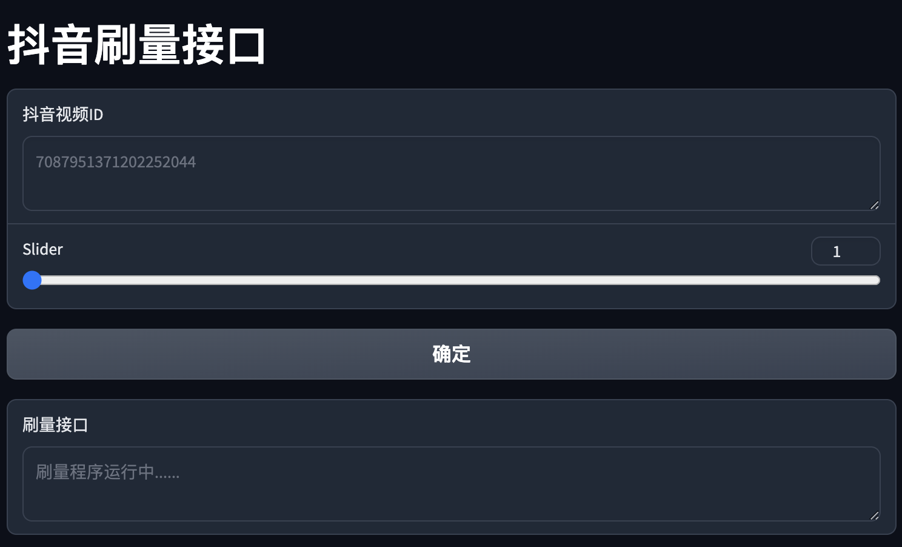

### 抖音刷分享协议，刷分享算法
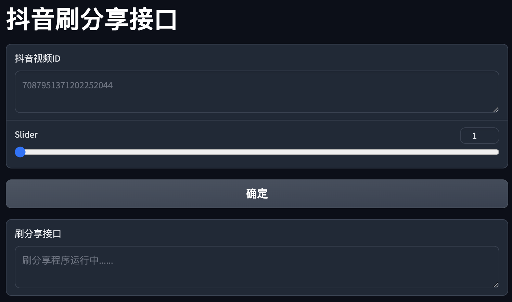

### 抖音播放量查询接口
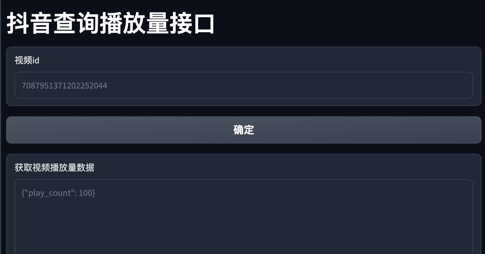

### 抖音直播间数据
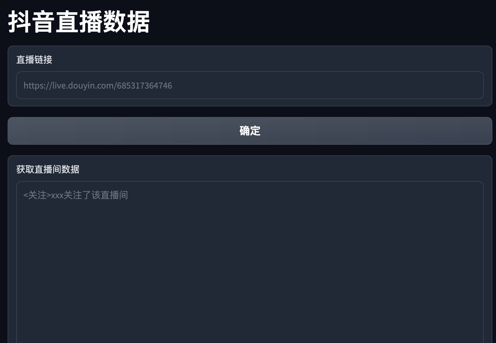


# [Contact Telegram](https://t.me/xgxkxaxl)
# [Contact SnapChat](https://www.snapchat.com/add/xgxkxaxl)
# [联系需翻墙](https://t.me/xgxkxaxl)
# [联系需翻墙](https://www.snapchat.com/add/xgxkxaxl)

